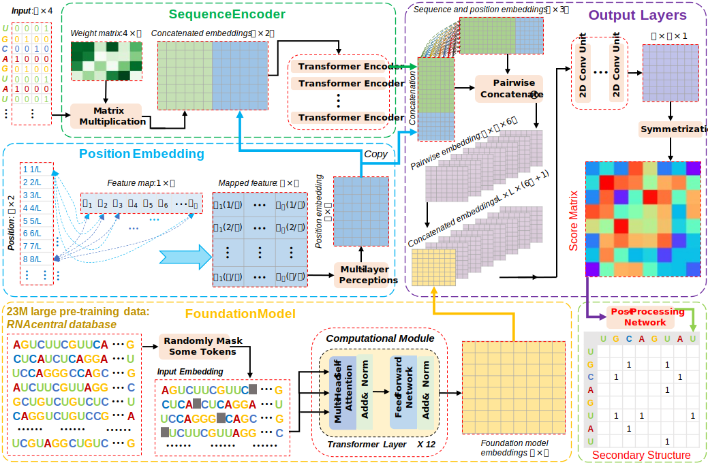

# E2Efold-FM 
E2Efold-FM: accurate RNA secondary structure prediction with end-to-end deep neural networks and RNA foundation model

This is the Pytorch implementation of E2Efold-FM.





## 1. System Requirements

The `E2Efold-FM` package is built under the Linux system with the popular softwares [Anaconda](https://www.anaconda.com/) and [Pytorch](https://pytorch.org/). The versions of the software dependencies that the `E2Efold-FM` package uses are provided in the `environment.yml`.


The versions of the software dependencies and data-analysis packages that `E2Efold-FM` has been tested on are given in the `environment.yml`. Users can conveniently create the same environment by running the command:
```
conda env create -f environment.yml
```


The `E2Efold-FM` package does not require any non-standard hardware.


## 2. Installation Guide


### Install the package
The environment that we use is given in `environment.yml`. You can create the same environment by running the command:
```
conda env create -f environment.yml
```


Please navigate to the `./E2Efold-FM` folder of this repository, and run the following command to install the package e2efoldFM:
```
conda activate e2efoldFM     # activate the environment
pip install -e .     # install the package
```


Adjust the version of the Pytorch according to the type of GPU research machine that you use for running this package. In the test we use NVIDIA RTX3090, so we update the Pytorch to version 1.10.0 by running the command:
```
pip install torch==1.10.0+cu113 torchvision==0.11.1+cu113 torchaudio==0.10.0+cu113 -f https://download.pytorch.org/whl/cu113/torch_stable.html
```


The installment of this package is fast and the whole install time is less than 5 minutes. 


### Folder structure

The project has the following folder structure:

```
E2Efold-FM
|___data  # data
|___e2efoldFM  # source code
|___e2efoldFM_productive  # productive code for handling new sequences
|___models_ckpt  # trained models
|___pics
|___results
...
```


## 3. Demo and Instructions for Use

To directly use our trained model to make prediction for any RNA sequence, please refer to the information in the `./e2efoldFM_productive` folder.


The sample RNA input sequences are under the `./e2efoldFM_productive/seqs` folder.


The expected output of these sample RNA input sequences are provided the folders: `./e2efoldFM_productive/cts` and `./e2efoldFM_productive/npy`.


The running speed of this package is very fast, it takes only several seconds to complete predictions for about 40 sequences.


The procedure of using this package to perform predictions is provided in the `README.md` file under the `./e2efoldFM_productive` folder.


## 4. Online Version - E2Efold-FM server.

If you have any trouble with the deployment of the local version of E2Efold-FM, you can access the online server of this package from this link, [E2Efold-FM](https://proj.cse.cuhk.edu.hk/aihlab/e2efoldFM/#/), which is freely available without any registration requirement.


Users can directly upload their RNA sequences and get accurate secondary structure prediction results conveniently after a short time of waiting. Furthermore, the RNA secondary structure prediction results with different formats (including fasta, ct, and image files) can be directly downloaded for convenient future usage.


